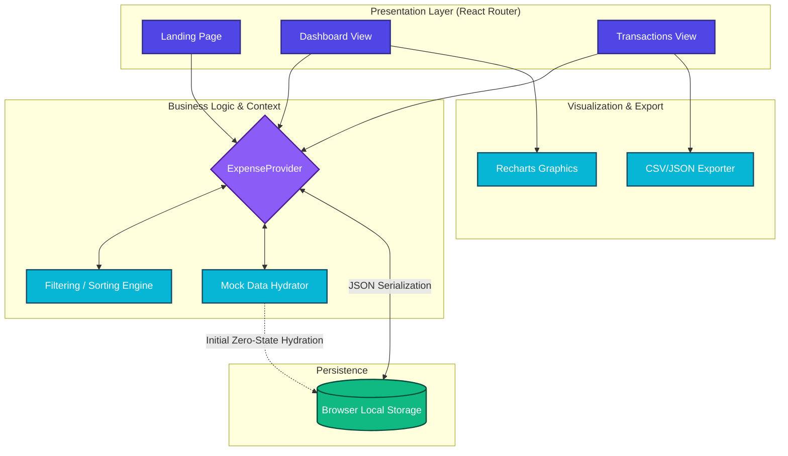

# 📈 Ledgerly: Professional Expense Management System

[](https://react.dev/)
[](https://www.typescriptlang.org/)
[](https://vitejs.dev/)
[](https://tailwindcss.com/)
[](https://opensource.org/licenses/MIT)

**Ledgerly** is a high-performance, client-side personal finance tracking web application built to demonstrate modern scalable frontend architecture, robust state management, and immersive user experiences leveraging Neo-Brutalism and Glassmorphism design principles.

Developed with a strict focus on Type Safety, Zero-Latency Data Processing, and Privacy-First local persistence.

---

## 🚀 Key Features

- **Real-Time Financial Dashboard**: Powered by [Recharts](https://recharts.org/), providing dynamic aggregated visualizations of cash flow trends and category-based expenditure tracking.
- **Privacy-First Data Architecture**: 100% serverless data storage utilizing optimized Browser `localStorage` APIs in sync with React Context. Your financial data never leaves your device.
- **Advanced State Management**: Custom Context Providers managing complex state hierarchies, cascading filters, and mock-data hydration triggers.
- **Role-Based Access Control (RBAC)**: Simulated robust permission management providing scoped access configurations between `ADMIN` and `VIEWER` roles.
- **Data Export Pipeline**: Integrated CSV and JSON export engine enabling users to port out their financial metadata cleanly at any temporal boundary.
- **Algorithmic Sorting & Filtering**: Memoized deeply nested UI filters (Transaction Type, Category grouping, Amount, Chronological sorting) eliminating unnecessary React render cycles.
- **Immersive User Interface**: Engineered with vanilla Tailwind utilities, fully responsive across all viewport bounds, equipped with dynamic hover states and seamless routing transition hooks.

---

## 🧠 System Architecture

The application focuses on an isolated Frontend Monolith structure designed to drastically reduce dependency coupling while sustaining high UI fidelity.



### Architecture Highlights
* **Presentation Layer**: Dispersed via `react-router-dom` to govern strict component encapsulation and global scroll interceptions.
* **Business Logic Layer**: `ExpenseProvider` establishes an unfragmented global state while tightly governing `useEffect` lifecycles to guarantee immutability standards. 
* **Data Layer**: An auto-parsing JSON boundary that intercepts mount events to regenerate algorithmic seed data seamlessly fallback mechanisms if user environments are wiped clean.

---

## 🛠️ Technology Stack

| Domain | Technology | Purpose |
| :--- | :--- | :--- |
| **Core Framework** | React 19 + TypeScript | Component creation and strict data typing. |
| **Build Tooling** | Vite | Lightning-fast HMR and optimized Rolldown production bundles. |
| **Styling** | Tailwind CSS + `lucide-react` | Utility-first styling enabling intricate glass/neo-brutal aesthetic. |
| **Data Visualization** | Recharts | Composable D3-based component charts tailored for performance. |
| **Date Processing** | Date-fns | Robust, lightweight chronological calculations and ISO string mapping. |
| **Routing** | React Router DOM v6 | Component-driven declarative routing and global location intercept handlers. |

---

## ⚙️ Local Development Setup

To run this repository locally, ensure that you have Node.js installed (`v18.0.0` or higher recommended).

1. **Clone the repository**
   ```bash
   git clone https://github.com/YOUR_GITHUB_USERNAME/my-money-manager.git
   cd my-money-manager
   ```

2. **Install Dependencies**
   ```bash
   npm install
   ```

3. **Start the Development Server**
   ```bash
   npm run dev
   ```
   *The application will boot at `http://localhost:5173`.*

4. **Run Build Verification**
   Ensure type safety standards and CSS linting pass before committing:
   ```bash
   npm run build
   ```

---

## 💡 Engineering Decisions & Trade-offs
* **Why Local Storage over a Backend Database?** To demonstrate the capability of building a strict serverless prototype that isolates authentication delays, prioritizing instant tactile feedback and state hydration logic within React context.
* **Custom Hooks (`useExpenseContext`)**: Prevented Prop Drilling and optimized re-renders by enforcing strict modularity between context initialization and UI consumption. Fast-Refresh compatibility was strictly maintained by isolating Provider exports from Hook exports.
* **Algorithmic Optimizations**: Minimized `O(N)` loop computations natively on the client using optimized React `useMemo` hooks for high-volume simulated data sets to sustain buttery 60FPS scrolling across Dashboard renderings.

---

<p align="center">
  <i>Developed with ❤️ by <b>Rebaka Meda</b></i><br>
  <a href="https://www.linkedin.com/in/rebaka-meda-6832b2367/">LinkedIn</a> • <a href="https://github.com/Rebaka8">GitHub</a>
</p>
